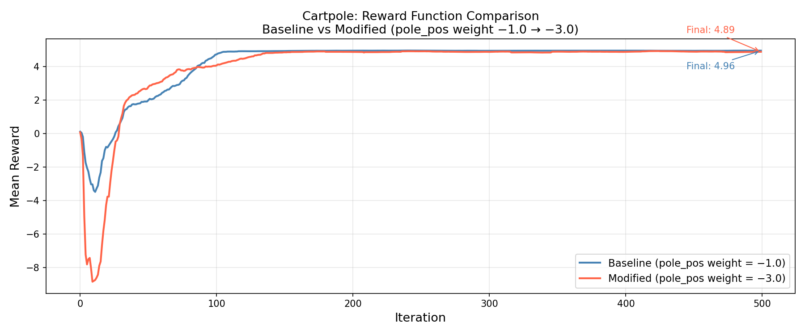
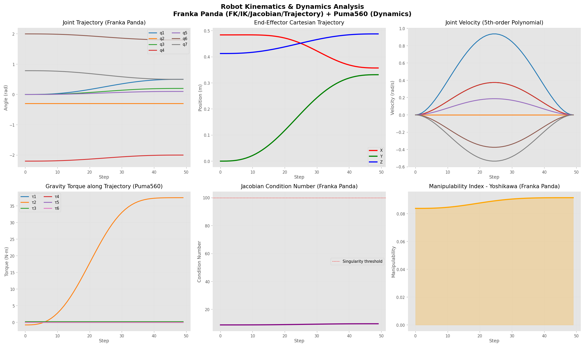

# dex-bench-mini

基于 NVIDIA Isaac Lab v2.1 的灵巧手 RL 训练 + 机器人学 Benchmark

[](https://developer.nvidia.com/isaac-sim)
[](https://github.com/isaac-sim/IsaacLab)
[](https://pytorch.org)
[](https://python.org)
[](https://github.com/petercorke/robotics-toolbox-python)

---

## 实验列表

| 实验 | 内容 | 关键结果 |
|------|------|---------|
| [Exp01](experiments/exp01_cartpole_reward_comparison/) | Cartpole Reward Function Comparison | Baseline 4.96 vs Modified 4.89 |
| [Exp02](experiments/exp02_allegro_repose/) | Allegro Hand Cube Reorientation | Mean Reward 12.31，25,058 steps/s |
| [Exp03](experiments/exp03_allegro_analysis/) | Allegro Hand Training Analysis | 多维度指标可视化 |
| [Exp04](experiments/exp04_robotics_kinematics/) | Robot Kinematics & Dynamics Analysis | IK error 0.000 mm，Manipulability 0.0838 |

---

## Experiment 01: Cartpole Reward Function Comparison



通过修改 `pole_pos` 惩罚权重（-1.0 → -3.0），验证 reward shaping 对 PPO 训练收敛的影响。

**结论：在已可解任务中，weight 调整主要影响 reward 数值尺度，不影响最终 policy 质量。**

| 配置 | 最终 Reward | Episode Length |
|------|------------|----------------|
| Baseline (w=-1.0) | **4.96** | 300.00（满分）|
| Modified (w=-3.0) | 4.89 | 299.02 |

---

## Experiment 02 & 03: Allegro Hand Cube Reorientation


在 RTX 4090D 上使用 PPO（rsl_rl）训练 Allegro Hand（16-DoF）完成 cube reorientation 任务。

| 指标 | 数值 |
|------|------|
| 最终 Mean Reward | **12.31** |
| 计算速度 | **25,058 steps/s** |
| 训练时长 | 33 分 58 秒 |
| track_orientation_inv_l2 | 0.7969 |
| consecutive_success | 1.4% |

---

## Experiment 04: Robot Kinematics & Dynamics Analysis



基于 Peter Corke Robotics Toolbox for Python，对 Franka Panda（运动学）和 Puma560（动力学）进行完整分析，覆盖机器人学完整知识链路：

```
SE(3) 空间变换 → DH 参数建模 → 正运动学 FK → 雅可比矩阵 → 逆运动学 IK → 轨迹规划 → 动力学
```

| 模块 | 机器人 | 方法 | 结果 |
|------|--------|------|------|
| 正运动学（FK）| Franka Panda | DH 参数递推 | 末端位置 [0.484, 0, 0.413] m |
| 逆运动学（IK）| Franka Panda | LM 数值法 | 位置误差 **0.000 mm** |
| 雅可比矩阵 | Franka Panda | 几何法 6×7 | 条件数 **8.91**（远离奇异点）|
| 轨迹规划 | Franka Panda | 5 次多项式插值 | 50 步平滑轨迹 |
| 重力补偿 | Puma560 | gravload | [0, -0.775, 0.249, 0, 0, 0] N·m |
| 逆动力学 | Puma560 | Newton-Euler（rne）| 静态力矩验证通过 |
| 可操作性 | Franka Panda | Yoshikawa 指数 | **0.0838**，全程无奇异风险 |

---

## 学习笔记

| 笔记 | 内容 |
|------|------|
| [Python 高级特性](notes/day04_python.md) | 函数式编程、生成器、OOP |
| [PyTorch 基础](notes/day04_pytorch.md) | Tensor、autograd、训练循环 |
| [Day 4 总结](notes/day04_summary.md) | 学习反思与简历连接点 |
| [机器人运动学基础](notes/robotToolBox.md) | SE(3)、DH 参数、FK/IK、雅可比、轨迹、动力学、符号计算（Robotics Toolbox）|
| [Isaac Lab 架构](notes/isaaclab_arch.md) | Manager-based 环境架构解析 |
| [PPO 算法笔记](notes/ppo.md) | PPO 原理、clip 机制、GAE |

---

## 技术栈

```
仿真平台:    Isaac Sim 4.5 + Isaac Lab v2.1.0
RL 算法:     PPO (rsl_rl)
深度学习:    PyTorch 2.5.1 + CUDA 12.1
机器人学:    roboticstoolbox-python 1.1.1 + spatialmath-python
硬件:        RTX 4090D 24GB (AutoDL)
语言:        Python 3.10
```

---

## 仓库结构

```
dex-bench-mini/
├── notes/                                   # 学习笔记
│   ├── day04_python.md
│   ├── day04_pytorch.md
│   ├── day04_summary.md
│   ├── robotToolBox.md                      # 机器人运动学基础（Robotics Toolbox）
│   ├── isaaclab_arch.md
│   ├── ppo.md
│   └── anyteleop.md / Bi_DexHands.md
├── experiments/
│   ├── exp01_cartpole_reward_comparison/
│   ├── exp02_allegro_repose/
│   ├── exp03_allegro_analysis/
│   └── exp04_robotics_kinematics/
└── learn/
    ├── day04_python.py
    └── day04_pytorch.py
```

---

## 作者

GitHub: [LIU478](https://github.com/LIU478)
