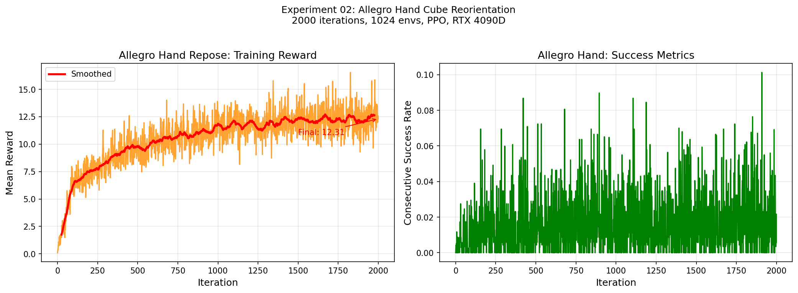

# Experiment 02: Allegro Hand Cube Reorientation

## Task

使用 Allegro Hand（16-DoF，4 指机械手）完成 cube reorientation 任务：
将立方体从随机初始姿态重定向到目标姿态。

## Setup

| 配置 | 值 |
|------|----|
| Task | Isaac-Repose-Cube-Allegro-v0 |
| Robot | Allegro Hand（16 joints，4 fingers）|
| Algorithm | PPO（rsl_rl）|
| num_envs | 1024 |
| max_iterations | 2000 |
| Hardware | RTX 4090D 24GB |
| 训练时长 | 33 分 58 秒 |
| 计算速度 | 25,058 steps/s |

## Reward Components

| 组件 | 最终值 | 作用 |
|------|--------|------|
| track_orientation_inv_l2 | 0.7969 | 姿态跟踪（越大越好）|
| success_bonus | 0.0058 | 成功奖励 |
| action_rate_l2 | -0.2164 | 动作平滑性惩罚 |
| action_l2 | -0.0116 | 动作幅度惩罚 |
| joint_vel_l2 | -0.0029 | 关节速度惩罚 |

## Training Results

| 指标 | 数值 |
|------|------|
| 最终 Mean Reward | **12.31** |
| 最终 Episode Length | **533.10** |
| 姿态误差（orientation_error）| 1.4072 rad（~80°）|
| 连续成功率（consecutive_success）| 1.4% |
| object_out_of_reach | 20.8% |

## Analysis

**2000 iter 对于 Allegro Hand 任务属于早期训练阶段**：

- Cartpole 在 ~100 iter 收敛（2-DoF 简单任务）
- Allegro Repose 需要 5000~20000 iter 才能稳定收敛
  （16-DoF，contact-rich，物理接触复杂）

**已观察到的学习信号**：
- `track_orientation_inv_l2 = 0.7969`（正值，说明 policy 在跟踪目标姿态）
- Mean Reward 从初始接近 0 上升到 12.31
- 未出现训练崩溃

**收敛瓶颈分析**：
- `object_out_of_reach = 0.2083` → 20% episode 物体滑落，抓握还不稳定
- `orientation_error = 1.4072 rad` → 姿态误差约 80°，还需要更多训练
- 如果继续训练到 5000+ iter，预计成功率会显著提升

## Comparison with Cartpole

| 维度 | Cartpole（Exp01）| Allegro Repose（Exp02）|
|------|------------------|------------------------|
| DoF | 2 | 16 |
| 任务类型 | 简单平衡 | contact-rich 操作 |
| 收敛 iter | ~100 | 5000+（预计）|
| 2000 iter 状态 | 完全收敛 | 早期学习 |
| 计算速度 | ~3000 steps/s | ~25000 steps/s（更多 envs）|
| 工程挑战 | 低 | 高（物理接触、抓握稳定性）|

## Key Takeaway

灵巧手任务的 RL 训练需要显著更多的 iteration，
contact-rich 任务的 reward 设计和物理参数调优
是决定训练成败的关键因素。

## Checkpoint

训练完成的模型存放在 `checkpoint/model_2000.pt`

## Files

- `allegro_training_curves.png`：训练曲线
- `checkpoint/model_2000.pt`：训练好的 policy
- `README.md`：本文档
