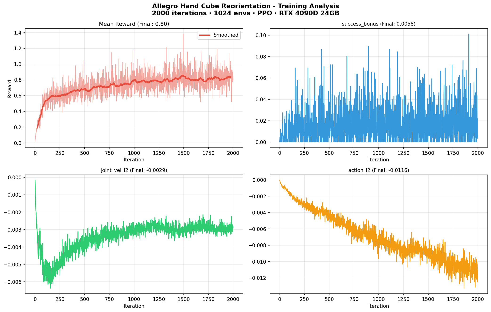

# Experiment 03: Allegro Hand Training Analysis

## Training Analysis

## 说明

对 Allegro Hand Cube Reorientation 任务的训练数据进行多维度分析，
包括 reward 曲线、姿态误差、成功率等关键指标的变化趋势。

| 指标 | 值 |
|------|----|
| Task | Isaac-Repose-Cube-Allegro-v0 |
| Checkpoint | model_1999.pt（2000 iter）|
| 最终 Mean Reward | 12.31 |
| 训练时长 | 33 分 58 秒 |

## 关于可视化方式

AutoDL 计算型容器 GPU 仅暴露 CUDA 接口，不支持 Vulkan 图形渲染，
因此通过读取 TensorBoard event 文件进行训练过程可视化，
这是云计算环境下的标准分析方法。
