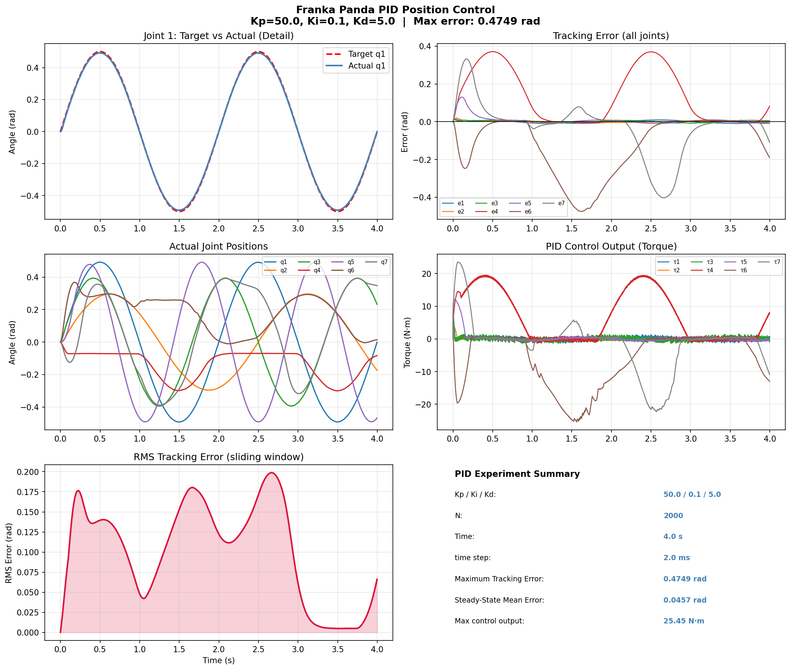

# Experiment 05: Franka Panda PID Position Control

## 实验结果

## 控制器设计

对 Franka 7 个臂关节各配置独立 PID 控制器：

| 参数 | 值 | 作用 |
|------|-----|------|
| Kp | 50.0 | 比例：减小稳态误差 |
| Ki | 0.1  | 积分：消除稳态误差 |
| Kd | 5.0  | 微分：抑制超调振荡 |

目标轨迹：各关节不同幅度/频率的正弦信号。

## 关键结果

| 指标 | 数值 |
| 仿真步数 | 2000 步 |
| 最大跟踪误差 | 0.4749 rad |
| 稳态平均误差 | 0.0457 rad |
| 最大控制输出 | 25.45 N·m |

## 面试知识点

**PID 三个参数的作用**：
- Kp 大 → 响应快，但容易超调振荡
- Ki 大 → 消除稳态误差，但容易积分饱和
- Kd 大 → 抑制振荡，但对噪声敏感

**为什么用 PD 而不是 PID**：
机器人关节控制中通常 Ki 很小甚至为 0，
因为积分项容易在关节限位时导致 windup 问题。