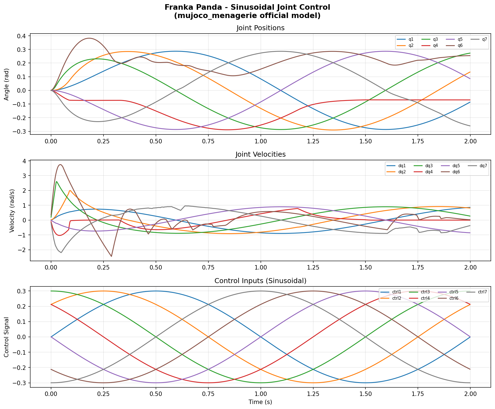

# Experiment 05: Franka Panda Joint Control (mujoco_menagerie)

## 实验结果

## 模型信息

| 参数 | 数值 |
|------|------|
| 关节数 | 9（7个臂关节 + 2个夹爪关节）|
| 执行器数 | 8 |
| 自由度 | 9 |
| 几何体数 | 82 |
| 模型来源 | mujoco_menagerie/franka_emika_panda |

## 实验内容

基于 Google DeepMind 官方模型库 mujoco_menagerie 加载
Franka Panda 真实机器人模型，对 7 个臂关节施加正弦控制信号：
ctrl[i] = 0.3 × sin(2π × 0.5t + i × π/4)

每个关节相位差 π/4，产生类波浪的协调运动。 
Franka的控制模式：力矩控制施加的也是正弦信号，下一次调整为PID位置控制

## 关键结果

| 指标 | 数值 |
|------|------|
| 仿真步数 | 1000 步 |
| 关节角范围 | [-0.291, 0.382] rad |
| 关节速度范围 | [-2.452, 3.747] rad/s |

## 知识点

**坑 1：视觉模型 vs 碰撞模型**

mujoco_menagerie 里的 Franka 模型有 82 个几何体，
其中大部分是 mesh 网格（视觉用），少部分是简单几何体（碰撞用）。
直接用 mesh 做碰撞检测会极慢，正确做法是用
capsule/sphere/box 近似碰撞形状。

**坑 2：夹爪关节**

Franka 有 9 个关节，不是 7 个：
- joint1-7：机械臂（主控制对象）
- finger_joint1-2：夹爪（单独控制）

控制时注意只对前 7 个关节施加控制信号。

## 与 Isaac Lab 实验对比

| 维度 | MuJoCo（本实验）| Isaac Lab（Exp02 Allegro）|
|------|----------------|--------------------------|
| 模型格式 | MJCF/XML | USD |
| GPU 依赖 | 不需要 | 必须 |
| 安装大小 | ~50MB | ~20GB |
| 并行环境 | 有限 | 1024+ |
| 适合场景 | 算法验证、控制设计 | 大规模 RL 训练 |